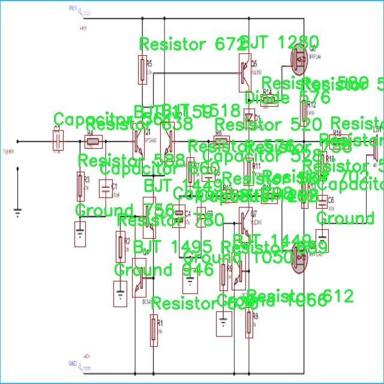
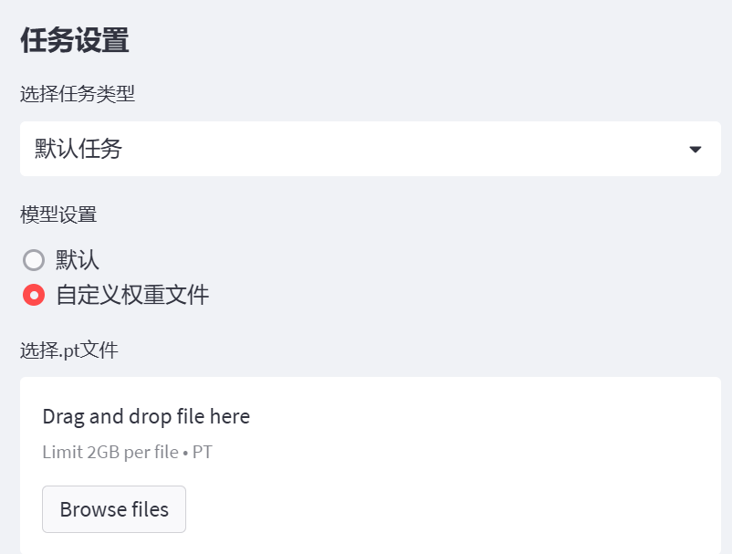

# 手绘电子元件符号检测检测系统源码分享
 # [一条龙教学YOLOV8标注好的数据集一键训练_70+全套改进创新点发刊_Web前端展示]

### 1.研究背景与意义

项目参考[AAAI Association for the Advancement of Artificial Intelligence](https://gitee.com/qunshansj/projects)

项目来源[AACV Association for the Advancement of Computer Vision](https://gitee.com/qunmasj/projects)

研究背景与意义

随着电子技术的迅猛发展，电子元件的设计与应用愈发复杂，手绘电子元件符号的识别与检测成为了电子工程领域中的一项重要任务。传统的电子元件符号识别方法往往依赖于人工识别或简单的图像处理技术，这不仅效率低下，而且容易受到人为因素的影响，导致识别准确率低下。因此，开发一种高效、准确的手绘电子元件符号检测系统显得尤为重要。

在此背景下，YOLO（You Only Look Once）系列目标检测算法因其优越的实时性和准确性，逐渐成为计算机视觉领域的研究热点。YOLOv8作为该系列的最新版本，具备了更强的特征提取能力和更快的推理速度，能够在复杂的场景中实现高效的目标检测。然而，现有的YOLOv8模型在特定领域的应用，如手绘电子元件符号的检测，仍然面临着一些挑战。手绘符号的多样性和复杂性使得模型在识别时可能出现误判或漏判。因此，针对这一问题，对YOLOv8进行改进，以提升其在手绘电子元件符号检测中的性能，具有重要的研究意义。

本研究旨在基于改进的YOLOv8模型，构建一个高效的手绘电子元件符号检测系统。我们将使用GRACompoents数据集，该数据集包含2000张手绘电子元件符号图像，涵盖17类不同的电子元件符号，包括AC_Source、BJT、Battery、Capacitor等。这些符号在电子电路设计中扮演着至关重要的角色，准确识别它们对于电路的理解和分析至关重要。通过对该数据集的深入分析与处理，我们将针对手绘符号的特征进行特定的模型改进，以提高模型的识别精度和鲁棒性。

此外，本研究的意义还在于推动电子工程教育与实践的结合。随着电子元件符号检测技术的进步，未来的电子工程师可以利用该系统快速识别和理解电路图，从而提高学习效率和实践能力。这不仅能够降低学习门槛，还能为电子工程的教学改革提供新的思路与方法。

综上所述，基于改进YOLOv8的手绘电子元件符号检测系统的研究，不仅具有重要的理论价值，还在实际应用中展现出广泛的前景。通过该研究，我们期望能够为电子元件符号的自动识别提供一种新的解决方案，推动电子工程领域的进一步发展，同时为相关技术的研究提供借鉴与参考。

### 2.图片演示


##### 注意：由于此博客编辑较早，上面“2.图片演示”和“3.视频演示”展示的系统图片或者视频可能为老版本，新版本在老版本的基础上升级如下：（实际效果以升级的新版本为准）

  （1）适配了YOLOV8的“目标检测”模型和“实例分割”模型，通过加载相应的权重（.pt）文件即可自适应加载模型。

  （2）支持“图片识别”、“视频识别”、“摄像头实时识别”三种识别模式。

  （3）支持“图片识别”、“视频识别”、“摄像头实时识别”三种识别结果保存导出，解决手动导出（容易卡顿出现爆内存）存在的问题，识别完自动保存结果并导出到tempDir中。

  （4）支持Web前端系统中的标题、背景图等自定义修改，后面提供修改教程。

  另外本项目提供训练的数据集和训练教程,暂不提供权重文件（best.pt）,需要您按照教程进行训练后实现图片演示和Web前端界面演示的效果。

### 3.视频演示

[3.1 视频演示](https://www.bilibili.com/video/BV17Dthe7EmS/)

### 4.数据集信息展示

##### 4.1 本项目数据集详细数据（类别数＆类别名）

nc: 17
names: ['AC_Source', 'BJT', 'Battery', 'Capacitor', 'Current_Source', 'DC_Source', 'Dep_Current_Source', 'Dep_DC_Source', 'Diode', 'Ground', 'Inductor', 'MOSFET', 'Node', 'Resistor', 'Resistor_Box', 'Voltage_Source', 'Zener_Diode']


##### 4.2 本项目数据集信息介绍

数据集信息展示

在本研究中，我们使用了名为“GRAComponents”的数据集，以改进YOLOv8模型在手绘电子元件符号检测系统中的表现。该数据集专门为电子元件符号的识别与分类而设计，包含了17个不同类别的电子元件符号。这些类别涵盖了电子电路中常见的元件，能够为模型提供丰富的训练样本，进而提升其检测精度和泛化能力。

“GRAComponents”数据集的类别包括：交流电源（AC_Source）、双极型晶体管（BJT）、电池（Battery）、电容器（Capacitor）、电流源（Current_Source）、直流电源（DC_Source）、依赖电流源（Dep_Current_Source）、依赖直流电源（Dep_DC_Source）、二极管（Diode）、接地（Ground）、电感器（Inductor）、场效应晶体管（MOSFET）、节点（Node）、电阻器（Resistor）、电阻箱（Resistor_Box）、电压源（Voltage_Source）以及齐纳二极管（Zener_Diode）。这些类别不仅涵盖了基本的电子元件，还包括了一些特定的电路组件，能够为模型提供多样化的学习材料。

在数据集的构建过程中，研究团队精心挑选了多种手绘风格的电子元件符号，确保每个类别的样本数量均衡且具有代表性。这种多样性不仅体现在符号的绘制风格上，还包括了不同的尺寸、角度和复杂度，旨在模拟真实应用场景中可能遇到的各种情况。通过这种方式，数据集能够有效地帮助YOLOv8模型学习到更为鲁棒的特征表示，从而提高其在实际应用中的表现。

此外，数据集中的每个样本都附带了详细的标注信息，包括元件的类别标签和位置信息。这些标注不仅为模型的训练提供了必要的监督信号，还为后续的模型评估和性能分析奠定了基础。通过对“GRAComponents”数据集的深入分析，我们可以识别出模型在不同类别上的表现差异，从而针对性地进行模型优化。

在训练过程中，我们将“GRAComponents”数据集与YOLOv8模型相结合，采用了数据增强技术，以进一步提升模型的泛化能力。通过对图像进行旋转、缩放、翻转等操作，我们能够生成更多的训练样本，从而有效缓解过拟合问题。此外，模型的训练策略也经过精心设计，结合了学习率调整、批量归一化等技术，以确保模型能够在较短的时间内收敛到最佳状态。

总之，“GRAComponents”数据集为改进YOLOv8的手绘电子元件符号检测系统提供了坚实的基础。通过丰富的类别设置和多样化的样本特征，该数据集不仅提升了模型的检测精度，也为未来的研究提供了宝贵的数据资源。随着研究的深入，我们期待能够在电子元件符号检测领域取得更为显著的进展，为相关应用提供更为高效的解决方案。





### 5.全套项目环境部署视频教程（零基础手把手教学）

[5.1 环境部署教程链接（零基础手把手教学）](https://www.ixigua.com/7404473917358506534?logTag=c807d0cbc21c0ef59de5)


[5.2 安装Python虚拟环境创建和依赖库安装视频教程链接（零基础手把手教学）](https://www.ixigua.com/7404474678003106304?logTag=1f1041108cd1f708b01a)

### 6.手把手YOLOV8训练视频教程（零基础小白有手就能学会）

[6.1 手把手YOLOV8训练视频教程（零基础小白有手就能学会）](https://www.ixigua.com/7404477157818401292?logTag=d31a2dfd1983c9668658)

### 7.70+种全套YOLOV8创新点代码加载调参视频教程（一键加载写好的改进模型的配置文件）

[7.1 70+种全套YOLOV8创新点代码加载调参视频教程（一键加载写好的改进模型的配置文件）](https://www.ixigua.com/7404478314661806627?logTag=29066f8288e3f4eea3a4)

### 8.70+种全套YOLOV8创新点原理讲解（非科班也可以轻松写刊发刊，V10版本正在科研待更新）

由于篇幅限制，每个创新点的具体原理讲解就不一一展开，具体见下列网址中的创新点对应子项目的技术原理博客网址【Blog】：


[8.1 70+种全套YOLOV8创新点原理讲解链接](https://gitee.com/qunmasj/good)

### 9.系统功能展示（检测对象为举例，实际内容以本项目数据集为准）

图9.1.系统支持检测结果表格显示

  图9.2.系统支持置信度和IOU阈值手动调节

  图9.3.系统支持自定义加载权重文件best.pt(需要你通过步骤5中训练获得)

  图9.4.系统支持摄像头实时识别

  图9.5.系统支持图片识别

  图9.6.系统支持视频识别

  图9.7.系统支持识别结果文件自动保存

  图9.8.系统支持Excel导出检测结果数据





### 10.原始YOLOV8算法原理

原始YOLOv8算法原理

YOLOv8是Ultralytics公司在2023年推出的目标检测算法，作为YOLO系列的最新版本，它在前几代的基础上进行了显著的改进和创新。YOLOv8不仅在性能上超越了YOLOv5、YOLOv6和YOLOv7等前辈，还在灵活性和易用性方面做出了重要的提升，使其成为图像处理领域中一个备受关注的选择。YOLOv8的设计理念围绕着快速、准确和用户友好展开，旨在满足各种目标检测、图像分割和图像分类任务的需求。

YOLOv8的网络结构可以分为三个主要部分：输入层（Input）、主干网络（Backbone）和检测头（Head）。在输入层，YOLOv8采用了640x640的默认图像尺寸，但在实际应用中，图像的长宽比往往不一致。为了解决这一问题，YOLOv8引入了自适应图片缩放的策略。这种方法通过将图像的长边按比例缩小到指定尺寸，然后对短边进行填充，最大限度地减少了信息冗余，提升了目标检测和推理的速度。此外，在训练过程中，YOLOv8使用了Mosaic图像增强技术，该技术通过随机选择四张图像进行缩放和拼接，生成新的训练样本。这种增强方式有效地迫使模型学习不同位置和周围像素的特征，从而提高了模型的预测精度和整体性能。

在主干网络部分，YOLOv8借鉴了YOLOv7中的ELAN模块设计思想，替换了YOLOv5中的C3模块，采用了C2F模块。C2F模块通过并行更多的梯度流分支，确保了在轻量化的基础上获取更丰富的梯度信息，从而提升了模型的精度和响应速度。C2F模块的设计使得YOLOv8在特征提取方面表现得更加出色，能够有效捕捉到不同尺度的目标特征。

在Neck部分，YOLOv8对结构进行了优化，去除了YOLOv5中两次上采样前的1x1卷积连接层，直接对主干网络不同阶段输出的特征进行上采样。这一变化简化了网络结构，减少了计算复杂度，同时保持了特征的完整性和有效性。

YOLOv8在Head部分的创新尤为显著，采用了Decoupled-Head（解耦头）结构，取代了YOLOv5中的Coupled-Head（耦合头）。在解耦头中，检测和分类的卷积操作被分开处理，输入特征图首先通过两个1x1卷积模块进行降维，然后分别生成类别预测和边界框位置预测。这种结构不仅提高了模型的灵活性，还增强了其在复杂场景下的表现。

YOLOv8还摒弃了传统的Anchor-Based（基于锚框）方法，转而采用Anchor-Free（无锚框）策略。这一转变使得目标检测的过程更加简化，不再需要在训练前对数据集进行锚框的聚类和设置。通过将目标检测转化为关键点检测，YOLOv8提高了模型的泛化能力，简化了网络框架，使得模型在处理不同类型的目标时更加灵活。

在损失函数的设计上，YOLOv8也进行了创新。分类分支依然采用BCELoss（Binary Cross Entropy Loss），而边界框回归分支则使用了DFL（Distribution Focal Loss）和CIoULoss（Complete Intersection over Union Loss）。这种损失函数的组合旨在使网络快速聚焦于标签附近的数值，从而提高目标检测的精度。

总的来说，YOLOv8在多个方面进行了优化和创新，使其在目标检测任务中表现出色。通过自适应的输入处理、改进的主干网络、简化的Neck结构以及解耦的Head设计，YOLOv8不仅提升了检测精度，还加快了推理速度。其无锚框的检测方法和创新的损失函数设计，使得YOLOv8在面对复杂场景时，能够更好地适应各种变化和挑战。作为YOLO系列的最新代表，YOLOv8无疑为目标检测领域带来了新的机遇和可能性。


### 11.项目核心源码讲解（再也不用担心看不懂代码逻辑）

#### 11.1 ui.py

以下是代码的核心部分，并附上详细的中文注释：

```python
import sys
import subprocess

def run_script(script_path):
    """
    使用当前 Python 环境运行指定的脚本。

    Args:
        script_path (str): 要运行的脚本路径

    Returns:
        None
    """
    # 获取当前 Python 解释器的路径
    python_path = sys.executable

    # 构建运行命令，使用 streamlit 运行指定的脚本
    command = f'"{python_path}" -m streamlit run "{script_path}"'

    # 执行命令，并等待其完成
    result = subprocess.run(command, shell=True)
    
    # 检查命令执行的返回码，0 表示成功，非0表示出错
    if result.returncode != 0:
        print("脚本运行出错。")

# 主程序入口
if __name__ == "__main__":
    # 指定要运行的脚本路径
    script_path = "web.py"  # 假设脚本在当前目录下

    # 调用函数运行脚本
    run_script(script_path)
```

### 代码分析：
1. **导入模块**：
   - `sys`：用于获取当前 Python 解释器的路径。
   - `subprocess`：用于执行外部命令。

2. **函数 `run_script`**：
   - 参数 `script_path`：接收要运行的脚本路径。
   - 使用 `sys.executable` 获取当前 Python 解释器的路径。
   - 构建命令字符串，使用 `streamlit` 模块运行指定的脚本。
   - 使用 `subprocess.run` 执行命令，并等待其完成。
   - 检查返回码，若不为0则输出错误信息。

3. **主程序入口**：
   - 通过 `if __name__ == "__main__":` 确保只有在直接运行该脚本时才会执行下面的代码。
   - 指定要运行的脚本路径（此处假设为 `web.py`）。
   - 调用 `run_script` 函数执行脚本。 

### 总结：
这段代码的核心功能是使用当前 Python 环境运行一个指定的脚本，并处理可能出现的错误。

这个程序文件 `ui.py` 的主要功能是通过当前的 Python 环境来运行一个指定的脚本，具体来说是一个名为 `web.py` 的脚本。程序首先导入了必要的模块，包括 `sys`、`os` 和 `subprocess`，这些模块分别用于获取系统信息、处理文件路径和执行外部命令。

在文件的开头，定义了一个名为 `run_script` 的函数，该函数接受一个参数 `script_path`，表示要运行的脚本的路径。函数内部首先获取当前 Python 解释器的路径，使用 `sys.executable` 来实现。接着，构建一个命令字符串，命令的格式是使用 Python 解释器来运行 `streamlit` 模块，并指定要运行的脚本路径。

然后，使用 `subprocess.run` 方法来执行这个命令。`shell=True` 参数允许在 shell 中执行命令。执行后，函数会检查命令的返回码，如果返回码不为零，表示脚本运行出错，此时会打印出一条错误信息。

在文件的最后部分，使用 `if __name__ == "__main__":` 语句来确保只有在直接运行该文件时才会执行以下代码。这里指定了要运行的脚本路径，调用 `abs_path` 函数来获取 `web.py` 的绝对路径。最后，调用 `run_script` 函数来运行这个脚本。

总体来说，这个文件的作用是提供一个简单的接口，通过 Python 环境来运行一个 Streamlit 应用，方便用户启动 Web 应用。

#### 11.2 70+种YOLOv8算法改进源码大全和调试加载训练教程（非必要）\ultralytics\nn\backbone\fasternet.py

以下是代码中最核心的部分，并附上详细的中文注释：

```python
import torch
import torch.nn as nn
from typing import List
from torch import Tensor

class Partial_conv3(nn.Module):
    """部分卷积层，用于处理输入的部分通道"""
    
    def __init__(self, dim, n_div, forward):
        super().__init__()
        self.dim_conv3 = dim // n_div  # 部分通道的维度
        self.dim_untouched = dim - self.dim_conv3  # 未改变的通道维度
        self.partial_conv3 = nn.Conv2d(self.dim_conv3, self.dim_conv3, 3, 1, 1, bias=False)  # 3x3卷积
        
        # 根据前向传播方式选择对应的函数
        if forward == 'slicing':
            self.forward = self.forward_slicing
        elif forward == 'split_cat':
            self.forward = self.forward_split_cat
        else:
            raise NotImplementedError

    def forward_slicing(self, x: Tensor) -> Tensor:
        """仅用于推理阶段的前向传播"""
        x = x.clone()  # 克隆输入以保持原始输入不变
        x[:, :self.dim_conv3, :, :] = self.partial_conv3(x[:, :self.dim_conv3, :, :])  # 处理部分通道
        return x

    def forward_split_cat(self, x: Tensor) -> Tensor:
        """用于训练和推理阶段的前向传播"""
        x1, x2 = torch.split(x, [self.dim_conv3, self.dim_untouched], dim=1)  # 按通道分割
        x1 = self.partial_conv3(x1)  # 对部分通道进行卷积
        x = torch.cat((x1, x2), 1)  # 连接处理后的通道和未处理的通道
        return x


class MLPBlock(nn.Module):
    """多层感知机块，包含卷积、归一化和激活函数"""
    
    def __init__(self, dim, n_div, mlp_ratio, drop_path, layer_scale_init_value, act_layer, norm_layer, pconv_fw_type):
        super().__init__()
        self.dim = dim
        self.mlp_ratio = mlp_ratio
        self.drop_path = nn.Identity() if drop_path <= 0 else DropPath(drop_path)  # 随机深度
        self.n_div = n_div

        mlp_hidden_dim = int(dim * mlp_ratio)  # MLP隐藏层维度

        # 定义MLP层
        mlp_layer: List[nn.Module] = [
            nn.Conv2d(dim, mlp_hidden_dim, 1, bias=False),
            norm_layer(mlp_hidden_dim),
            act_layer(),
            nn.Conv2d(mlp_hidden_dim, dim, 1, bias=False)
        ]
        self.mlp = nn.Sequential(*mlp_layer)  # 组合成顺序模块

        # 空间混合
        self.spatial_mixing = Partial_conv3(dim, n_div, pconv_fw_type)

        # 初始化层缩放
        if layer_scale_init_value > 0:
            self.layer_scale = nn.Parameter(layer_scale_init_value * torch.ones((dim)), requires_grad=True)
            self.forward = self.forward_layer_scale  # 使用层缩放的前向传播
        else:
            self.forward = self.forward  # 默认前向传播

    def forward(self, x: Tensor) -> Tensor:
        """前向传播"""
        shortcut = x  # 保存输入以便后续残差连接
        x = self.spatial_mixing(x)  # 空间混合
        x = shortcut + self.drop_path(self.mlp(x))  # 残差连接
        return x

    def forward_layer_scale(self, x: Tensor) -> Tensor:
        """使用层缩放的前向传播"""
        shortcut = x
        x = self.spatial_mixing(x)
        x = shortcut + self.drop_path(self.layer_scale.unsqueeze(-1).unsqueeze(-1) * self.mlp(x))  # 残差连接与层缩放
        return x


class FasterNet(nn.Module):
    """FasterNet模型"""
    
    def __init__(self, in_chans=3, num_classes=1000, embed_dim=96, depths=(1, 2, 8, 2), mlp_ratio=2., n_div=4,
                 patch_size=4, patch_stride=4, patch_size2=2, patch_stride2=2, patch_norm=True, 
                 drop_path_rate=0.1, layer_scale_init_value=0, norm_layer='BN', act_layer='RELU', pconv_fw_type='split_cat'):
        super().__init__()

        # 选择归一化层和激活函数
        norm_layer = nn.BatchNorm2d if norm_layer == 'BN' else NotImplementedError
        act_layer = nn.GELU if act_layer == 'GELU' else partial(nn.ReLU, inplace=True)

        self.num_stages = len(depths)  # 模型阶段数
        self.embed_dim = embed_dim  # 嵌入维度
        self.patch_norm = patch_norm  # 是否使用归一化
        self.mlp_ratio = mlp_ratio  # MLP比率
        self.depths = depths  # 每个阶段的深度

        # 分割图像为不重叠的补丁
        self.patch_embed = PatchEmbed(patch_size=patch_size, patch_stride=patch_stride, in_chans=in_chans, embed_dim=embed_dim, norm_layer=norm_layer if self.patch_norm else None)

        # 随机深度衰减规则
        dpr = [x.item() for x in torch.linspace(0, drop_path_rate, sum(depths))]

        # 构建各个阶段
        stages_list = []
        for i_stage in range(self.num_stages):
            stage = BasicStage(dim=int(embed_dim * 2 ** i_stage), n_div=n_div, depth=depths[i_stage], mlp_ratio=self.mlp_ratio,
                               drop_path=dpr[sum(depths[:i_stage]):sum(depths[:i_stage + 1])], layer_scale_init_value=layer_scale_init_value,
                               norm_layer=norm_layer, act_layer=act_layer, pconv_fw_type=pconv_fw_type)
            stages_list.append(stage)

            # 添加补丁合并层
            if i_stage < self.num_stages - 1:
                stages_list.append(PatchMerging(patch_size2=patch_size2, patch_stride2=patch_stride2, dim=int(embed_dim * 2 ** i_stage), norm_layer=norm_layer))

        self.stages = nn.Sequential(*stages_list)  # 将所有阶段组合成顺序模块

    def forward(self, x: Tensor) -> Tensor:
        """前向传播，输出四个阶段的特征"""
        x = self.patch_embed(x)  # 嵌入补丁
        outs = []
        for idx, stage in enumerate(self.stages):
            x = stage(x)  # 通过每个阶段
            if idx in self.out_indices:  # 如果是输出阶段
                norm_layer = getattr(self, f'norm{idx}')  # 获取对应的归一化层
                x_out = norm_layer(x)  # 归一化
                outs.append(x_out)  # 保存输出
        return outs
```

### 代码核心部分说明：
1. **Partial_conv3**：实现了部分卷积的功能，允许在不同的前向传播方式下处理输入。
2. **MLPBlock**：实现了多层感知机的结构，包含卷积、归一化和激活函数，支持残差连接和层缩放。
3. **FasterNet**：整个网络的主结构，负责将输入图像分割为补丁，并通过多个阶段进行处理，最终输出特征。

以上代码是FasterNet模型的核心部分，提供了网络的基本构建块和前向传播逻辑。

这个程序文件实现了一个名为FasterNet的深度学习模型，主要用于计算机视觉任务。文件中包含了多个类和函数，用于构建模型的不同组件和加载预训练权重。

首先，文件导入了必要的库，包括PyTorch和一些用于构建神经网络的模块。接着，定义了多个类，分别实现了模型的不同部分。

Partial_conv3类实现了一个部分卷积层，支持两种前向传播方式：切片（slicing）和拼接（split_cat）。在切片模式下，仅对输入的部分通道进行卷积操作，而在拼接模式下，输入被分成两部分，卷积后再拼接。

MLPBlock类实现了一个多层感知机块，包含了一个卷积层、归一化层、激活函数和另一个卷积层。该类支持使用层级缩放（layer scale）来调整输出。

BasicStage类则是由多个MLPBlock组成的阶段，负责处理输入并传递到下一层。

PatchEmbed类用于将输入图像分割成小块，并通过卷积将其嵌入到更高维度的空间中。PatchMerging类则用于在不同阶段合并小块，减少特征图的尺寸。

FasterNet类是整个模型的核心，负责将上述组件组合在一起。它定义了模型的输入通道、类别数、嵌入维度等参数，并通过循环构建多个阶段。在前向传播中，模型将输入通过嵌入层和多个阶段处理，并在指定的输出层应用归一化。

此外，文件中还定义了一些函数用于加载模型的权重，包括update_weight函数，该函数用于更新模型的权重字典，确保权重的形状匹配。

最后，提供了多个函数（如fasternet_t0、fasternet_t1等）用于创建不同配置的FasterNet模型，并加载相应的配置文件和权重。

在文件的主程序部分，创建了一个FasterNet模型实例，并打印了模型的通道信息。随后，生成了一些随机输入数据，并通过模型进行前向传播，输出每个阶段的特征图的尺寸。

总体来说，这个文件实现了一个灵活且高效的深度学习模型，适用于各种计算机视觉任务，支持不同的配置和预训练权重加载。

#### 11.3 code\ultralytics\models\yolo\classify\predict.py

以下是经过简化和注释的核心代码部分：

```python
import cv2
import torch
from PIL import Image
from ultralytics.engine.predictor import BasePredictor
from ultralytics.engine.results import Results
from ultralytics.utils import ops

class ClassificationPredictor(BasePredictor):
    """
    分类预测器类，继承自BasePredictor类，用于基于分类模型的预测。
    """

    def __init__(self, cfg=DEFAULT_CFG, overrides=None, _callbacks=None):
        """初始化分类预测器，将任务设置为'分类'。"""
        super().__init__(cfg, overrides, _callbacks)  # 调用父类构造函数
        self.args.task = "classify"  # 设置任务类型为分类
        self._legacy_transform_name = "ultralytics.yolo.data.augment.ToTensor"  # 旧版转换名称

    def preprocess(self, img):
        """将输入图像转换为模型兼容的数据类型。"""
        # 检查输入是否为torch.Tensor类型
        if not isinstance(img, torch.Tensor):
            # 检查是否使用了旧版转换
            is_legacy_transform = any(
                self._legacy_transform_name in str(transform) for transform in self.transforms.transforms
            )
            if is_legacy_transform:  # 处理旧版转换
                img = torch.stack([self.transforms(im) for im in img], dim=0)
            else:
                # 将图像从BGR转换为RGB并应用转换
                img = torch.stack(
                    [self.transforms(Image.fromarray(cv2.cvtColor(im, cv2.COLOR_BGR2RGB))) for im in img], dim=0
                )
        # 将图像转换为适合模型的类型并移动到相应设备
        img = (img if isinstance(img, torch.Tensor) else torch.from_numpy(img)).to(self.model.device)
        return img.half() if self.model.fp16 else img.float()  # 将uint8转换为fp16/32

    def postprocess(self, preds, img, orig_imgs):
        """对预测结果进行后处理，返回Results对象。"""
        # 如果输入图像不是列表，则将其转换为numpy数组
        if not isinstance(orig_imgs, list):
            orig_imgs = ops.convert_torch2numpy_batch(orig_imgs)

        results = []
        # 遍历每个预测结果
        for i, pred in enumerate(preds):
            orig_img = orig_imgs[i]  # 获取原始图像
            img_path = self.batch[0][i]  # 获取图像路径
            # 将结果添加到列表中
            results.append(Results(orig_img, path=img_path, names=self.model.names, probs=pred))
        return results  # 返回结果列表
```

### 代码注释说明：
1. **导入模块**：导入必要的库，包括OpenCV、PyTorch、PIL以及Ultralytics相关模块。
2. **ClassificationPredictor类**：这是一个分类预测器类，专门用于处理分类任务，继承自`BasePredictor`。
3. **构造函数**：初始化时设置任务类型为分类，并处理旧版转换名称。
4. **preprocess方法**：负责将输入图像转换为模型所需的格式，包括处理旧版转换和设备迁移。
5. **postprocess方法**：对模型的预测结果进行后处理，生成包含原始图像、路径、类别名称和概率的结果对象列表。

这个程序文件是一个用于图像分类的预测器，属于Ultralytics YOLO框架的一部分。文件中定义了一个名为`ClassificationPredictor`的类，该类继承自`BasePredictor`，专门用于基于分类模型进行预测。

在类的初始化方法`__init__`中，调用了父类的构造函数，并将任务类型设置为“classify”，这表明该预测器的主要功能是进行分类。此外，`_legacy_transform_name`属性用于处理旧版的图像转换。

`preprocess`方法负责将输入图像转换为模型可以接受的数据格式。首先，它检查输入是否为`torch.Tensor`类型。如果不是，则根据是否使用了旧版转换来处理图像。如果使用了旧版转换，代码会将图像堆叠成一个张量；否则，首先将图像从BGR格式转换为RGB格式，然后再进行转换。最后，图像会被移动到模型所在的设备上，并根据模型的精度设置将数据类型转换为半精度或单精度浮点数。

`postprocess`方法用于处理模型的预测结果，并将其转换为`Results`对象。它首先检查原始图像是否为列表，如果不是，则将其转换为NumPy数组。接着，代码遍历每个预测结果，将原始图像、图像路径、模型名称和预测概率打包成`Results`对象，并将这些对象存储在结果列表中。

整个文件的设计旨在提供一个灵活的接口，支持多种图像分类模型，并通过简单的API调用进行预测。用户可以通过传入不同的模型和图像源来快速实现图像分类任务。

#### 11.4 70+种YOLOv8算法改进源码大全和调试加载训练教程（非必要）\ultralytics\engine\predictor.py

以下是代码中最核心的部分，并附上详细的中文注释：

```python
class BasePredictor:
    """
    BasePredictor类用于创建预测器的基类。
    """

    def __init__(self, cfg=DEFAULT_CFG, overrides=None, _callbacks=None):
        """
        初始化BasePredictor类。

        参数:
            cfg (str, optional): 配置文件的路径，默认为DEFAULT_CFG。
            overrides (dict, optional): 配置覆盖，默认为None。
        """
        self.args = get_cfg(cfg, overrides)  # 获取配置
        self.save_dir = get_save_dir(self.args)  # 获取保存结果的目录
        if self.args.conf is None:
            self.args.conf = 0.25  # 默认置信度为0.25
        self.done_warmup = False  # 是否完成预热
        if self.args.show:
            self.args.show = check_imshow(warn=True)  # 检查是否可以显示图像

        # 初始化模型相关属性
        self.model = None
        self.data = self.args.data  # 数据配置
        self.imgsz = None  # 图像大小
        self.device = None  # 设备
        self.dataset = None  # 数据集
        self.vid_path, self.vid_writer = None, None  # 视频路径和视频写入器
        self.plotted_img = None  # 绘制的图像
        self.data_path = None  # 数据路径
        self.source_type = None  # 数据源类型
        self.batch = None  # 批次
        self.results = None  # 结果
        self.transforms = None  # 转换
        self.callbacks = _callbacks or callbacks.get_default_callbacks()  # 回调函数
        self.txt_path = None  # 文本路径
        callbacks.add_integration_callbacks(self)  # 添加集成回调

    def preprocess(self, im):
        """
        在推理之前准备输入图像。

        参数:
            im (torch.Tensor | List(np.ndarray)): 输入图像，BCHW格式的张量或[(HWC) x B]格式的列表。
        """
        not_tensor = not isinstance(im, torch.Tensor)  # 检查是否为张量
        if not_tensor:
            im = np.stack(self.pre_transform(im))  # 预处理图像
            im = im[..., ::-1].transpose((0, 3, 1, 2))  # BGR转RGB，BHWC转BCHW
            im = np.ascontiguousarray(im)  # 确保数组是连续的
            im = torch.from_numpy(im)  # 转换为张量

        im = im.to(self.device)  # 将图像移动到指定设备
        im = im.half() if self.model.fp16 else im.float()  # uint8转fp16/32
        if not_tensor:
            im /= 255  # 将像素值从0-255缩放到0.0-1.0
        return im

    def inference(self, im, *args, **kwargs):
        """对给定图像运行推理。"""
        return self.model(im, augment=self.args.augment)  # 使用模型进行推理

    def __call__(self, source=None, model=None, stream=False, *args, **kwargs):
        """对图像或流执行推理。"""
        self.stream = stream
        if stream:
            return self.stream_inference(source, model, *args, **kwargs)  # 实时推理
        else:
            return list(self.stream_inference(source, model, *args, **kwargs))  # 合并结果

    def stream_inference(self, source=None, model=None, *args, **kwargs):
        """在摄像头输入上进行实时推理并将结果保存到文件。"""
        if not self.model:
            self.setup_model(model)  # 设置模型

        self.setup_source(source if source is not None else self.args.source)  # 设置数据源

        # 预热模型
        if not self.done_warmup:
            self.model.warmup(imgsz=(1, 3, *self.imgsz))  # 预热模型
            self.done_warmup = True

        for batch in self.dataset:  # 遍历数据集
            path, im0s, vid_cap, s = batch  # 获取当前批次的路径、图像、视频捕获对象和字符串

            im = self.preprocess(im0s)  # 预处理图像
            preds = self.inference(im, *args, **kwargs)  # 进行推理
            self.results = self.postprocess(preds, im, im0s)  # 后处理结果

            for i in range(len(im0s)):
                p, im0 = path[i], im0s[i].copy()  # 获取路径和图像
                self.write_results(i, self.results, (p, im, im0))  # 写入结果

            yield from self.results  # 生成结果

    def setup_model(self, model, verbose=True):
        """使用给定参数初始化YOLO模型并设置为评估模式。"""
        self.model = AutoBackend(model or self.args.model, device=select_device(self.args.device, verbose=verbose))
        self.device = self.model.device  # 更新设备
        self.model.eval()  # 设置模型为评估模式
```

### 代码核心部分说明：
1. **BasePredictor类**：这是一个用于创建预测器的基类，包含了模型的初始化、数据预处理、推理和结果处理等功能。
2. **__init__方法**：初始化预测器的配置、保存目录和其他必要的属性。
3. **preprocess方法**：对输入图像进行预处理，包括转换为张量、调整大小和归一化。
4. **inference方法**：使用模型对预处理后的图像进行推理。
5. **__call__方法**：允许类的实例像函数一样被调用，执行推理操作。
6. **stream_inference方法**：实现实时推理的逻辑，处理输入流并生成推理结果。
7. **setup_model方法**：初始化YOLO模型并设置为评估模式。

这个程序文件是YOLOv8算法的预测器实现，主要用于对图像、视频、流媒体等进行目标检测。程序中包含了多个方法和类，主要功能是设置模型、处理输入数据、执行推理、处理输出结果等。

在文件开头，提供了YOLOv8的使用说明，包括支持的输入源（如摄像头、图片、视频、YouTube链接等）和模型格式（如PyTorch、ONNX、TensorRT等）。这些信息帮助用户了解如何使用该预测器进行目标检测。

`BasePredictor`类是该文件的核心类，负责初始化和管理预测过程。它的构造函数接收配置文件路径和其他参数，设置模型的基本属性，包括保存结果的目录、模型的配置、设备类型等。`preprocess`方法用于对输入图像进行预处理，将其转换为适合模型输入的格式。

`inference`方法执行实际的推理过程，调用模型进行预测。`write_results`方法负责将预测结果写入文件或目录，并可选择将检测框绘制到图像上。`postprocess`方法对模型的输出进行后处理，以便返回最终的预测结果。

`__call__`方法允许用户通过调用实例来执行推理，可以处理流媒体或单张图像。`stream_inference`方法专门用于实时推理，处理每一帧图像并进行预测，同时支持结果的保存和可视化。

在设置模型时，`setup_model`方法会初始化YOLO模型并将其设置为评估模式。`show`方法使用OpenCV显示图像，`save_preds`方法则负责将预测结果保存为视频文件或图像文件。

此外，程序中还包含了回调机制，允许用户在特定事件发生时执行自定义函数，这为扩展和定制化提供了便利。

总的来说，这个文件实现了YOLOv8算法的核心预测功能，提供了灵活的输入源和输出处理方式，适用于各种目标检测任务。

#### 11.5 code\ultralytics\models\yolo\obb\predict.py

以下是代码中最核心的部分，并附上详细的中文注释：

```python
import torch
from ultralytics.engine.results import Results
from ultralytics.models.yolo.detect.predict import DetectionPredictor
from ultralytics.utils import ops

class OBBPredictor(DetectionPredictor):
    """
    OBBPredictor类，扩展了DetectionPredictor类，用于基于定向边界框（OBB）模型的预测。
    """

    def __init__(self, cfg=DEFAULT_CFG, overrides=None, _callbacks=None):
        """初始化OBBPredictor，支持模型和数据配置的可选覆盖。"""
        super().__init__(cfg, overrides, _callbacks)  # 调用父类的初始化方法
        self.args.task = "obb"  # 设置任务类型为"obb"

    def postprocess(self, preds, img, orig_imgs):
        """后处理预测结果，并返回Results对象的列表。"""
        # 应用非极大值抑制（NMS）来过滤重叠的预测框
        preds = ops.non_max_suppression(
            preds,
            self.args.conf,  # 置信度阈值
            self.args.iou,  # IOU阈值
            agnostic=self.args.agnostic_nms,  # 是否使用类别无关的NMS
            max_det=self.args.max_det,  # 最大检测数量
            nc=len(self.model.names),  # 类别数量
            classes=self.args.classes,  # 选择的类别
            rotated=True,  # 是否处理旋转框
        )

        # 如果输入图像不是列表，转换为numpy数组
        if not isinstance(orig_imgs, list):
            orig_imgs = ops.convert_torch2numpy_batch(orig_imgs)

        results = []  # 存储结果的列表
        for pred, orig_img, img_path in zip(preds, orig_imgs, self.batch[0]):
            # 将预测框的坐标从当前图像的尺寸缩放到原始图像的尺寸
            pred[:, :4] = ops.scale_boxes(img.shape[2:], pred[:, :4], orig_img.shape, xywh=True)
            # 将预测框的xywh坐标、置信度和类别信息组合成OBB格式
            obb = torch.cat([pred[:, :4], pred[:, -1:], pred[:, 4:6]], dim=-1)
            # 创建Results对象并添加到结果列表中
            results.append(Results(orig_img, path=img_path, names=self.model.names, obb=obb))
        return results  # 返回结果列表
```

### 代码核心部分说明：
1. **类定义**：`OBBPredictor`类继承自`DetectionPredictor`，用于处理定向边界框的预测。
2. **初始化方法**：在初始化时设置任务类型为"obb"，并调用父类的初始化方法。
3. **后处理方法**：`postprocess`方法负责对模型的预测结果进行后处理，包括：
   - 应用非极大值抑制（NMS）来去除重叠的预测框。
   - 将预测框的坐标从当前图像的尺寸缩放到原始图像的尺寸。
   - 将处理后的预测框信息组合成OBB格式，并存储在`Results`对象中，最终返回所有结果。

这个程序文件是Ultralytics YOLO模型的一部分，专门用于基于定向边界框（Oriented Bounding Box，OBB）进行目标检测的预测。文件中定义了一个名为`OBBPredictor`的类，它继承自`DetectionPredictor`类，扩展了目标检测的功能。

在文件的开头，导入了必要的库和模块，包括`torch`库和一些Ultralytics框架中的类和函数。`Results`类用于存储预测结果，`DetectionPredictor`类是进行目标检测的基类，而`ops`模块则包含了一些常用的操作函数。

`OBBPredictor`类的构造函数`__init__`接受三个参数：`cfg`（配置），`overrides`（覆盖的配置），和`_callbacks`（回调函数）。在构造函数中，调用了父类的构造函数，并将任务类型设置为“obb”，表明该预测器是用于定向边界框的。

`postprocess`方法用于处理模型的预测结果。它首先调用`non_max_suppression`函数，对预测结果进行非极大值抑制，以减少重复检测的框。这个函数使用了一些参数，如置信度阈值、IoU阈值、最大检测数量等，确保最终输出的检测框是最优的。

接下来，方法检查输入的原始图像是否为列表，如果不是，则将其转换为NumPy数组。然后，方法遍历每个预测结果、原始图像和图像路径，进行坐标缩放，以适应原始图像的尺寸。最后，将处理后的定向边界框（包含位置、置信度和类别信息）存储在`Results`对象中，并将这些对象收集到一个列表中返回。

总体而言，这个文件的功能是实现基于定向边界框的目标检测，提供了模型的初始化和结果后处理的实现，适用于需要处理旋转目标的应用场景。

#### 11.6 train.py

以下是经过简化和注释的核心代码部分，主要集中在 `DetectionTrainer` 类的关键功能上：

```python
import random
import numpy as np
import torch.nn as nn
from ultralytics.data import build_dataloader, build_yolo_dataset
from ultralytics.engine.trainer import BaseTrainer
from ultralytics.models import yolo
from ultralytics.nn.tasks import DetectionModel
from ultralytics.utils import LOGGER, RANK
from ultralytics.utils.torch_utils import de_parallel, torch_distributed_zero_first

class DetectionTrainer(BaseTrainer):
    """
    扩展自 BaseTrainer 类，用于基于检测模型的训练。
    """

    def build_dataset(self, img_path, mode="train", batch=None):
        """
        构建 YOLO 数据集。

        参数:
            img_path (str): 包含图像的文件夹路径。
            mode (str): 模式为 `train` 或 `val`，用户可以为每种模式自定义不同的增强。
            batch (int, optional): 批次大小，适用于 `rect` 模式。默认为 None。
        """
        gs = max(int(de_parallel(self.model).stride.max() if self.model else 0), 32)
        return build_yolo_dataset(self.args, img_path, batch, self.data, mode=mode, rect=mode == "val", stride=gs)

    def get_dataloader(self, dataset_path, batch_size=16, rank=0, mode="train"):
        """构造并返回数据加载器。"""
        assert mode in ["train", "val"]
        with torch_distributed_zero_first(rank):  # 仅在 DDP 中初始化数据集 *.cache 一次
            dataset = self.build_dataset(dataset_path, mode, batch_size)
        shuffle = mode == "train"  # 训练模式下打乱数据
        workers = self.args.workers if mode == "train" else self.args.workers * 2
        return build_dataloader(dataset, batch_size, workers, shuffle, rank)  # 返回数据加载器

    def preprocess_batch(self, batch):
        """对一批图像进行预处理，包括缩放和转换为浮点数。"""
        batch["img"] = batch["img"].to(self.device, non_blocking=True).float() / 255  # 将图像转换为浮点数并归一化
        if self.args.multi_scale:  # 如果启用多尺度
            imgs = batch["img"]
            sz = (
                random.randrange(self.args.imgsz * 0.5, self.args.imgsz * 1.5 + self.stride)
                // self.stride
                * self.stride
            )  # 随机选择新的尺寸
            sf = sz / max(imgs.shape[2:])  # 计算缩放因子
            if sf != 1:
                ns = [
                    math.ceil(x * sf / self.stride) * self.stride for x in imgs.shape[2:]
                ]  # 计算新的形状
                imgs = nn.functional.interpolate(imgs, size=ns, mode="bilinear", align_corners=False)  # 调整图像大小
            batch["img"] = imgs
        return batch

    def get_model(self, cfg=None, weights=None, verbose=True):
        """返回 YOLO 检测模型。"""
        model = DetectionModel(cfg, nc=self.data["nc"], verbose=verbose and RANK == -1)  # 创建检测模型
        if weights:
            model.load(weights)  # 加载权重
        return model

    def plot_training_samples(self, batch, ni):
        """绘制带有注释的训练样本。"""
        plot_images(
            images=batch["img"],
            batch_idx=batch["batch_idx"],
            cls=batch["cls"].squeeze(-1),
            bboxes=batch["bboxes"],
            paths=batch["im_file"],
            fname=self.save_dir / f"train_batch{ni}.jpg",
            on_plot=self.on_plot,
        )

    def plot_metrics(self):
        """从 CSV 文件绘制指标。"""
        plot_results(file=self.csv, on_plot=self.on_plot)  # 保存结果图像
```

### 代码说明：
1. **构建数据集**：`build_dataset` 方法用于根据给定的图像路径和模式（训练或验证）构建 YOLO 数据集，支持不同的增强方式。
2. **获取数据加载器**：`get_dataloader` 方法构造并返回数据加载器，确保在分布式训练中只初始化一次数据集。
3. **预处理批次**：`preprocess_batch` 方法对输入的图像批次进行预处理，包括归一化和可选的多尺度调整。
4. **获取模型**：`get_model` 方法用于创建并返回 YOLO 检测模型，支持加载预训练权重。
5. **绘制训练样本**：`plot_training_samples` 方法用于可视化训练样本及其注释。
6. **绘制指标**：`plot_metrics` 方法用于从 CSV 文件中绘制训练过程中的指标。

以上代码是 YOLO 检测模型训练的核心部分，包含了数据处理、模型构建和可视化等关键功能。

这个程序文件 `train.py` 是一个用于训练 YOLO（You Only Look Once）目标检测模型的实现，继承自 `BaseTrainer` 类。程序的主要功能是构建数据集、加载数据、预处理图像、设置模型属性、获取模型、验证模型、记录损失、绘制训练样本和指标等。

在程序的开头，导入了一些必要的库和模块，包括数学运算、随机数生成、深度学习相关的 PyTorch 模块，以及 Ultralytics 提供的 YOLO 相关的工具和类。

`DetectionTrainer` 类是这个文件的核心，负责训练过程的管理。首先，它定义了 `build_dataset` 方法，用于构建 YOLO 数据集，支持训练和验证模式，并允许用户为不同模式自定义数据增强。该方法会根据模型的步幅（stride）来调整图像的大小。

接着，`get_dataloader` 方法用于构建数据加载器，确保在分布式训练时只初始化一次数据集，并根据训练或验证模式设置数据加载的参数，比如是否打乱数据顺序。

`preprocess_batch` 方法负责对图像批次进行预处理，包括将图像缩放到合适的大小并转换为浮点数格式。它还支持多尺度训练，通过随机选择图像大小来增强模型的鲁棒性。

`set_model_attributes` 方法用于设置模型的属性，包括类别数量和类别名称，以便模型能够正确处理数据。

`get_model` 方法返回一个 YOLO 检测模型，并可以加载预训练权重。

`get_validator` 方法返回一个用于验证模型性能的验证器，并定义了损失名称。

`label_loss_items` 方法用于返回带有标签的训练损失字典，方便后续的损失记录和分析。

`progress_string` 方法生成一个格式化的字符串，显示训练进度，包括当前的轮次、GPU 内存使用情况、损失值、实例数量和图像大小等信息。

`plot_training_samples` 方法用于绘制训练样本及其标注，便于可视化训练过程中的数据。

最后，`plot_metrics` 和 `plot_training_labels` 方法分别用于绘制训练过程中的指标和标签，帮助用户分析模型的训练效果。

总体而言，这个文件实现了 YOLO 模型训练的各个环节，提供了灵活的配置和可视化功能，适合用于目标检测任务的训练。

### 12.系统整体结构（节选）

### 整体功能和构架概括

该项目是一个基于YOLO（You Only Look Once）目标检测框架的实现，主要用于图像和视频中的目标检测、分类和分割任务。项目包含多个模块和文件，分别负责不同的功能，如模型的定义、训练、预测、数据处理和可视化等。整体架构旨在提供一个灵活且高效的接口，支持多种模型配置和训练策略，以满足不同的计算机视觉需求。

以下是每个文件的功能整理表：

| 文件路径                                                                                                   | 功能描述                                                                                                                                                  |
|------------------------------------------------------------------------------------------------------------|---------------------------------------------------------------------------------------------------------------------------------------------------------|
| `D:\tools\20240809\code\ui.py`                                                                             | 提供一个简单的接口，通过Python环境运行指定的Streamlit应用（如`web.py`），用于可视化和交互式操作。                                                     |
| `D:\tools\20240809\code\70+种YOLOv8算法改进源码大全和调试加载训练教程（非必要）\ultralytics\nn\backbone\fasternet.py` | 实现FasterNet模型，包含多个神经网络组件（如卷积层、MLP块等），用于计算机视觉任务的特征提取和处理。                                                 |
| `D:\tools\20240809\code\code\ultralytics\models\yolo\classify\predict.py`                                | 实现图像分类的预测器，处理输入图像并将其转换为模型可以接受的格式，执行推理并返回分类结果。                                                          |
| `D:\tools\20240809\code\70+种YOLOv8算法改进源码大全和调试加载训练教程（非必要）\ultralytics\engine\predictor.py` | 实现YOLO目标检测的核心预测功能，支持多种输入源和输出处理方式，管理推理过程并可视化结果。                                                            |
| `D:\tools\20240809\code\code\ultralytics\models\yolo\obb\predict.py`                                     | 实现基于定向边界框（OBB）的目标检测，处理模型的预测结果，进行非极大值抑制和结果后处理。                                                             |
| `D:\tools\20240809\code\train.py`                                                                          | 负责YOLO模型的训练过程，包括数据集构建、数据加载、模型初始化、损失记录和训练样本可视化等功能。                                                      |
| `D:\tools\20240809\code\70+种YOLOv8算法改进源码大全和调试加载训练教程（非必要）\ultralytics\models\fastsam\prompt.py` | 实现FastSAM模型的提示功能，处理输入数据并生成相应的输出，支持快速的分割和检测任务。                                                                   |
| `D:\tools\20240809\code\70+种YOLOv8算法改进源码大全和调试加载训练教程（非必要）\ultralytics\nn\extra_modules\attention.py` | 实现注意力机制模块，增强模型对重要特征的关注能力，通常用于提升模型的性能和准确性。                                                                   |
| `D:\tools\20240809\code\code\ultralytics\utils\torch_utils.py`                                           | 提供与PyTorch相关的工具函数，支持模型训练和推理过程中的各种操作，如权重加载、设备管理等。                                                           |
| `D:\tools\20240809\code\70+种YOLOv8算法改进源码大全和调试加载训练教程（非必要）\ultralytics\utils\callbacks\dvc.py` | 实现数据版本控制（DVC）相关的回调函数，支持训练过程中的模型版本管理和数据追踪。                                                                        |
| `D:\tools\20240809\code\70+种YOLOv8算法改进源码大全和调试加载训练教程（非必要）\ultralytics\nn\extra_modules\rep_block.py` | 实现残差块（Residual Block），用于构建深度神经网络，增强模型的表达能力和训练稳定性。                                                               |
| `D:\tools\20240809\code\code\ultralytics\models\rtdetr\__init__.py`                                      | 初始化RT-DETR模型，设置模型的基本属性和配置，通常用于目标检测任务。                                                                                   |
| `D:\tools\20240809\code\code\ultralytics\models\sam\modules\encoders.py`                                 | 实现SAM（Segment Anything Model）中的编码器模块，负责对输入数据进行编码处理，提取特征以供后续处理。                                                  |

这个表格概述了每个文件的主要功能，帮助理解整个项目的结构和各个模块之间的关系。

注意：由于此博客编辑较早，上面“11.项目核心源码讲解（再也不用担心看不懂代码逻辑）”中部分代码可能会优化升级，仅供参考学习，完整“训练源码”、“Web前端界面”和“70+种创新点源码”以“13.完整训练+Web前端界面+70+种创新点源码、数据集获取”的内容为准。

### 13.完整训练+Web前端界面+70+种创新点源码、数据集获取


# [下载链接：https://mbd.pub/o/bread/ZpuWlZ1y](https://mbd.pub/o/bread/ZpuWlZ1y)